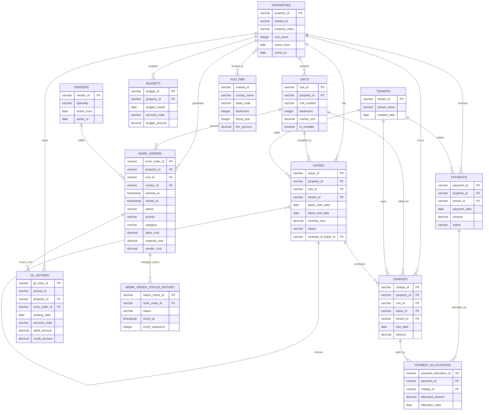

# Raw Data Documentation

This diagram represents the synthetic raw DuckDB schema generated by
`src/pma/generate.py`. It shows the primary business relationships; common
provenance columns are omitted for readability.

## Business context

This data describes a conventional multifamily property-management business. The
business owns or operates apartment communities, leases individual units to
residents, bills residents, collects payments, maintains the physical assets,
and reports financial performance against budget.

The main business questions are:

- **Asset and occupancy:** Which properties and units exist, which units are
  rentable, and which leases are active, ending, or turning over?
- **Revenue and collections:** What was billed, what was collected, and which
  tenant balances remain outstanding?
- **Financial performance:** How do actual property expenses and revenue compare
  with the general ledger and budget?
- **Maintenance operations:** Where is service demand high, are work orders
  meeting response and resolution expectations, and are vendor costs unusual?
- **Market context:** How do rents relate to public HUD Fair Market Rent
  benchmarks for the same market and bedroom count?

## How the business process flows

1. A **property** is an apartment community in a market. It contains many
   **units**, and the property and unit active dates define whether the asset is
   available for analysis at a given cutoff.
2. A **tenant** signs a **lease** for a unit. A unit can have many leases over
   time, but overlapping leases for the same unit are generally invalid. A
   lease can point to a prior lease when it is a renewal.
3. A lease produces resident **charges** such as rent or fees. Residents make
   **payments**, which are applied to charges through
   **payment_allocations**. This is why payments and charges are many-to-many;
   never assume one payment equals one charge.
4. Property activity is recorded in **GL entries**, grouped into journals, and
   compared with **budgets** by property, month, and account. GL is the
   accounting view of posted activity; charges and payments are the resident
   subledger view.
5. Maintenance demand creates **work orders** for a property or unit. A vendor
   may fulfill the work, and the status-history table records the event timeline
   needed to calculate response time, resolution time, backlog, and reopenings.
6. **HUD FMR** supplies an external market benchmark. It is context for rent
   comparisons, not a property transaction, valuation, or forecast.

## Table grains and modeling implications

| Raw table | Business grain | Modeling implication |
| --- | --- | --- |
| `properties` | One row per property | Use as the asset-level anchor; respect `active_from`/`active_to`. |
| `units` | One row per unit | Join to property before calculating rentable inventory or occupancy. |
| `tenants` | One row per tenant identity | A tenant may have multiple leases over time. |
| `leases` | One row per lease term | Filter by dates and status for point-in-time occupancy; preserve renewals and turnover. |
| `charges` | One row per billed charge | Aggregate only after choosing the reporting grain; credits may reduce the charge. |
| `payments` | One row per received payment | Do not treat payment amount as payment against a single charge. |
| `payment_allocations` | One row per payment-to-charge application | Use to calculate paid and outstanding balances without double counting. |
| `gl_entries` | One row per journal line | Balance journals using debit and credit; aggregate by account and property only after validation. |
| `budgets` | One row per property-month-account plan | Compare to actuals at the same property/month/account grain. |
| `vendors` | One row per vendor | Vendor identity and specialty support comparable maintenance analysis. |
| `work_orders` | One row per maintenance request | Costs belong to the work order; status is the current snapshot. |
| `work_order_status_history` | One row per work-order status event | Use event sequence and timestamps for lifecycle metrics, not the snapshot alone. |
| `hud_fmr` | One row per market-bedroom-fiscal-year benchmark | Join by market and bedroom; do not join directly by property ID. |

## Notes

- The tables live under the DuckDB `raw` schema.
- Provenance columns are present on every generated table:
  `source_system`, `source_record_id`, `source_loaded_at`, and `is_synthetic`.
- `hud_fmr` relates to properties through `market_id` and bedroom count rather
  than a direct property foreign key.
- The diagram describes analytical relationships and does not imply that the
  synthetic raw tables enforce database-level foreign-key constraints.

## Known raw data-quality issues

The generator writes these defects into the raw business tables before dbt runs.
They are intentionally visible in `raw.*`; dbt only cleans them in downstream
models.

| Raw table | Planted issue | Raw condition |
| --- | --- | --- |
| `charges` | Duplicate charge | `CHG-0000101` appears twice with identical values. |
| `leases` | Overlapping lease | `DQ-LEASE-OVERLAP-001` overlaps an existing lease for its unit. |
| `leases` | Invalid lease dates | `DQ-LEASE-DATES-001` ends before it starts. |
| `payment_allocations` | Orphan allocation | `DQ-ALLOC-ORPHAN-001` references `CHG-NOT-FOUND`. |
| `gl_entries` | Inactive-property activity | `DQ-J-INACTIVE-001` posts two balanced lines for inactive `TPA-B03`. |
| `work_orders` | Missing vendor | The first plumbing work order has a null `vendor_id`. |
| `work_order_status_history` | Valid reopen | One closed work order is reopened and reclosed; this history is retained. |
